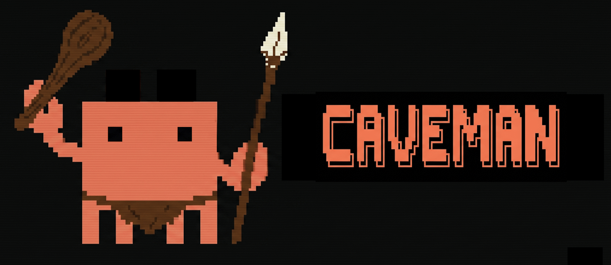

<p align="center">
  
</p>

<h1 align="center">Caveman Output Style for Claude Code</h1>

<p align="center">
  <strong>why waste words when few work?</strong>
</p>

<p>
  Claude Code caveman output style. 
  - Less fluff. 
  - Same technical signal. 
  - Can be set as always on by default. 
  - Better adherence than CLAUDE.md or skills.
</p>

## quick start

One command. Done.

```bash
# macOS / Linux
mkdir -p ~/.claude/output-styles && cp ./.claude/output-styles/caveman.md ~/.claude/output-styles/caveman.md
```

```powershell
# Windows
New-Item -ItemType Directory $HOME\.claude\output-styles -Force | Out-Null; Copy-Item .\.claude\output-styles\caveman.md $HOME\.claude\output-styles\caveman.md -Force
```

Then: `/options` → `Output Style` → `Caveman`. Restart session.

Want it always on? Add to `~/.claude/settings.json`:

```json
{ "outputStyle": "caveman" }
```

## Why use caveman?

| prompt | normal answer | caveman answer | rough token cut |
| --- | --- | --- | --- |
| why build fail? | Build is failing because TypeScript cannot resolve the `@/auth` import after the alias change. Update the path mapping or import path. | Build fails: TypeScript cannot resolve `@/auth`. Fix alias or import path. | ~42% |
| what changed in auth? | I updated the middleware to reject missing bearer tokens before decoding the JWT, which prevents the null token crash. | Auth middleware now rejects missing bearer token before JWT decode. Crash gone. | ~45% |
| how set default style? | Open your Claude settings file and add the `outputStyle` field with the value `caveman`, then start a new session. | Add `"outputStyle": "caveman"` to settings. Start new session. | ~47% |

Real token count vary. Table shows rough reduction only. Pattern same: less fluff out -> less output spend.

Same answer. Less bla. Also mean lower cost and less wasted compute.

Use when:

- You keep typing "be concise"
- You want same terse format every turn
- You want less output spend without losing technical substance

## why output style, not other things

Official docs show output styles change how Claude responds, not what Claude knows.

For goal "talk short every turn," output style fit exact job:

| tool | good for | why worse for this? |
| --- | --- | --- |
| output style | tone, format, structure | always on once selected. direct fix for reply shape |
| `CLAUDE.md` | project rules, conventions, codebase memory | adds user message after default prompt. not purpose-built for response style, directive lost on long threads |
| agents | delegated tasks with own tools, model, context | agents solve specific jobs. not base voice for whole session |
| skills | reusable workflows, task prompts | skills load when invoked or relevant. Claude Code may decide against using it. Not always-on formatting layer |

Short version: want caveman every reply -> use output style.

Reference: [Claude Code output styles docs](https://code.claude.com/docs/en/output-styles)

## why this save tokens

Custom style text adds ~100 input tokens up front, cached after first request in session.

Big win comes from shorter replies every turn.

Less unnecessary output: lower token bill, less energy wasted on filler.

Backed by research: [Brevity Constraints Reverse Performance Hierarchies in Language Models](https://arxiv.org/abs/2604.00025). Shorter answer keeps quality, and sometimes even improves it.

## FAQ

**Does caveman make Claude dumber?**
No. Same knowledge. Same reasoning. Just shorter output. Research shows brevity can improve answer quality.

**Will it break code generation?**
No. `keep-coding-instructions: true` keeps all coding behavior intact. Only the voice changes.

**Can I switch back?**
Yes. `/options` → pick different style. Or remove from `settings.json`.

**Does it work with skills and agents?**
Yes. Output style is the base voice. Skills and agents still work normally.

**Why not just tell Claude "be concise"?**
You can. But you have to say it every turn. Output style is always on. Set once. Forget.

**Does it save money?**
Yes. Fewer output tokens = lower cost. Especially on long sessions.

**Can I customize it?**
Yes. Edit `caveman.md` in your `~/.claude/output-styles/` folder. Make it your own.

## license

MIT. Do what you want.
